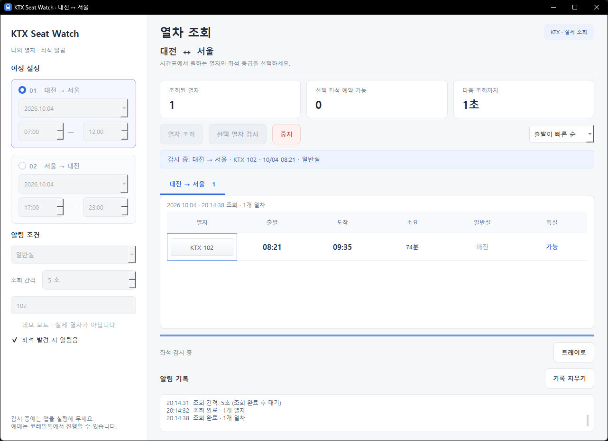
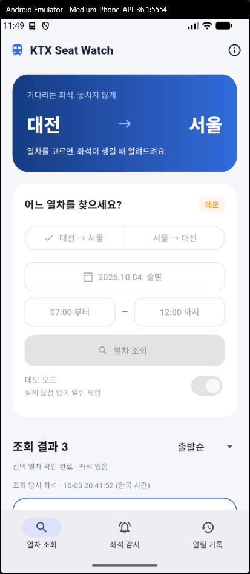

# KTX 대전 ↔ 서울 좌석 알림 (Python)

대전↔서울 KTX 좌석을 조회하고 선택한 열차의 잔여 좌석을 알리는 Windows·Android 앱입니다.
Windows는 PyQt6, Android는 Flutter와 기기 내 Python 조회 엔진을 사용합니다.

## 스크린샷

### Windows



### Android



## 개발 시작

Windows에서 Python 3.11 이상을 설치한 뒤 `setup_app.bat`을 실행하고 `start_app.bat`으로 앱을 시작합니다.
Android 빌드에는 Python 3.13, Flutter, Android SDK/JDK가 추가로 필요합니다.
자세한 모바일 사용·빌드 방법은 [mobile/README.md](mobile/README.md)를 참고하세요.

저장소에는 소스와 테스트가 포함됩니다. `dist/`의 EXE·APK는 아래 빌드 스크립트로 생성합니다.
가상환경, 로그, 빌드 캐시, 로컬 SDK 설정과 Android 서명 키는 Git에서 제외됩니다.
기존 Android 앱 업데이트에 필요한 서명 키는 별도로 안전하게 보관하세요.

## Android 앱 (Flutter)

`dist/KTXSeatWatch.apk`를 Android 휴대폰에 설치할 수 있습니다. 모바일 화면에서 열차를 조회하고 좌석 등급을 선택하면 화면을 꺼도 Android 서비스가 감시합니다. PC나 별도 서버는 필요하지 않습니다.

알림 권한을 허용하고 필요하면 앱 배터리 제한을 해제하세요. 연속 감시는 최대 5시간 50분이며 Android 실행 한도·절전 정책에 따라 먼저 중지되거나 지연될 수 있습니다. 강제 종료·재부팅 후에는 사용자가 다시 시작해야 합니다.

다시 빌드하려면 `build_apk.bat`을 실행합니다. 사용법·빌드 환경·서명 키 보관 안내는 [mobile/README.md](mobile/README.md)를 참고하세요.

## Windows 앱 (PyQt6)

### 단일 실행 파일

`dist/KTXSeatWatch.exe`를 더블클릭하면 실행됩니다. 배포 시 이 EXE 파일 하나만 복사하면 되며, Python이나 `.venv`는 필요하지 않습니다.
콘솔 창 없이 GUI로 실행되며, 데모 모드는 `KTXSeatWatch.exe --demo`로 시작합니다.
PyInstaller 단일 파일 방식이므로 시작 시 임시 폴더에 내부 구성 요소를 풀며 첫 실행에 시간이 걸릴 수 있습니다.

소스 수정 후 `build_exe.bat`을 실행하면 `start_app.bat`과 같은 진입점인 `ktx_app.py`를 다시 빌드합니다.
빌드에는 `setup_app.bat`으로 만든 가상환경과 패키지 설치용 인터넷 연결이 필요합니다.
완성 파일은 `dist/KTXSeatWatch.exe`, 빌드 중간 파일은 `build/`에 생성됩니다.
`start_app.bat`의 `logs/launch_*.log`는 배치 실행용이며 EXE에서는 생성되지 않습니다.

### Python으로 실행

`setup_app.bat`을 한 번 실행해 필요한 패키지를 설치한 뒤 `start_app.bat`을 실행하세요.
앱은 흰색·중성 회색 배경과 파란색 포인트를 사용합니다. 시간표 비교를 위한 목록과 선택한 감시 대상을 중심으로 구성했습니다.
`preview_ui.py`를 실행하면 모의 데이터가 포함된 화면을 `logs/ui_preview.png`로 저장합니다.

```powershell
cd train_res
.\.venv\Scripts\python.exe -m pip install -r requirements.txt
.\.venv\Scripts\python.exe ktx_app.py

# 실제 조회 없이 화면과 좌석 알림 흐름 확인
.\.venv\Scripts\python.exe ktx_app.py --demo
```

1. 왼쪽에서 **대전→서울 / 서울→대전 중 하나**를 선택하고 해당 날짜·출발 시간 범위, 좌석 등급을 지정합니다. 기본 날짜는 내일입니다.
2. **열차 조회** 후 목록에서 원하는 열차의 **일반실 또는 특실 칸**을 클릭하고 **선택 열차 감시**를 누릅니다.
   클릭한 열차 번호가 왼쪽 알림 조건에 자동 입력되고, 일반실/특실 칸을 클릭하면 좌석 등급도 함께 바뀝니다.
   시간·열차 번호 칸 클릭 시에는 기존 좌석 등급을 유지합니다. 왼쪽에서 등급을 직접 변경해도 됩니다.
   선택 없이 감시를 시작할 수 없습니다.
3. 상단에서 출발순·소요시간순·도착순을 바꿀 수 있습니다. 선택한 방향의 목록만 표시됩니다.
4. 감시 중 좌석을 찾으면 앱 배너, 알림 기록, 알림음, Windows 트레이 알림으로 알려줍니다.
5. **중지**로 감시를 끝냅니다. **트레이로**를 누르면 창을 숨긴 상태에서 계속 감시합니다.
   창의 X 또는 트레이 메뉴의 종료는 앱과 감시를 모두 종료합니다.

감시 대상은 날짜·방향·열차 번호·출발 시각으로 고정하며, 화면에 감시 대상과 좌석 등급을 표시합니다.
감시 중에는 선택 열차의 출발 시각만 재조회하고, 서버 응답에 다른 열차가 포함돼도 감시·알림에서 제외합니다.
일반실만 선택하면 특실이 풀려도 알리지 않습니다(반대도 동일). `일반실 + 특실`은 둘 중 하나가 있으면 알립니다.
열차 번호 입력란은 최초 조회 결과를 좁히는 필터이며, 전체 열차 감시 기능이 아닙니다.
목록 정렬을 바꿔도 선택 열차가 유지됩니다. 조회 날짜·방향·데모 여부를 바꾸면 다시 조회 후 선택하세요.

데모에서는 최초 조회 시 매진 열차 목록을 표시하고, 선택한 열차를 감시하면 두 번째 감시 조회에서 선택 등급에 좌석이 생깁니다.
이를 확인하려면 데모 모드에서 조회 → 열차/좌석 선택 → **선택 열차 감시** 순서로 진행하세요.
실제 조회와 데모는 화면 오른쪽 위 배지로 구분합니다.
앱을 시작할 때마다 알림 이력과 설정은 초기화됩니다.
Windows 알림 설정에 따라 트레이 알림이 표시되지 않을 수 있으나 앱 내 기록은 남습니다.

조회는 별도 `QThread`에서 실행합니다. 중지·종료 시 진행 중인 요청은 타임아웃까지 기다릴 수 있으며,
그동안 UI는 응답합니다. 다음 페이지 요청과 다음 주기의 조회는 취소됩니다.
최초 조회 실패 시 결과를 가져오지 못했다고 안내합니다. 이전 성공 결과가 있을 때만 이전 결과로 표시하며 예약 가능 열차 수 집계에서 제외합니다.
앱 업데이트/접근 거절 응답은 재시도하지 않고 즉시 감시를 중지합니다.

- `ktx_app.py`: PyQt6 화면, 트레이, 알림
- `gui_theme.py`: Qt 스타일시트
- `desktop_worker.py`: 백그라운드 조회와 감시
- `ktx_watch.py`: 공용 데이터 모델·조회 로직 및 기존 CLI

GUI 테스트는 `.\.venv\Scripts\python.exe -m unittest -v`에 포함됩니다. PyQt6가 없는 환경에서는 GUI 테스트가 생략됩니다.
현재 가상환경에서 PyQt6 6.11.0으로 GUI 렌더링 및 모의 응답 테스트를 실행했습니다.
실제 코레일 연동과 Windows 알림 수신은 별도 확인이 필요합니다.
배치 실행 오류는 실행마다 별도로 생성하는 `logs/launch_*.log`에 기록되며, 오류 종료 시 콘솔에 표시하고 키 입력을 기다립니다.
여러 앱 인스턴스가 동일한 로그 파일을 잠가 다음 실행을 막는 문제를 방지합니다.
가상환경 활성화는 필요하지 않습니다. 배치 파일은 자신의 폴더에 있는 `.venv` Python을 직접 실행합니다.
사용 API 참고: [Qt QThread](https://doc.qt.io/qt-6/qthread.html),
[Qt 시스템 트레이 알림](https://doc.qt.io/qt-6/qsystemtrayicon.html).

## 콘솔 버전

Python 3.11 이상. 콘솔 버전은 양방향 KTX 조회도 지원하며 출발이 빠른 순으로 표시합니다.
기본은 성인 1명, 일반실 감시이며, 조회 완료 후 60초 뒤 다시 조회합니다.
좌석이 있으면 콘솔 메시지와 Windows 알림음·팝업으로 알립니다.

## 실행 (PowerShell)

```powershell
python -m venv .venv
.\.venv\Scripts\python.exe -m pip install -r requirements.txt
.\.venv\Scripts\python.exe ktx_watch.py --date 2026-10-04
```

날짜를 생략하면 한국 시간 오늘입니다. 조회 시간대가 지난 경우 오류로 안내합니다.
프로그램과 PC가 실행 중이어야 계속 감시합니다. 종료는 `Ctrl+C`입니다.
이 코드는 조회·알림만 수행합니다. 알림을 받으면 코레일톡에서 직접 예매하세요.

## 사용 예

```powershell
# 대전→서울 오전, 서울→대전 저녁
.\.venv\Scripts\python.exe ktx_watch.py --date 2026-10-04 --start 07:00 --end 11:00 --return-start 18:00 --return-end 22:00

# 다음 날 돌아오기
.\.venv\Scripts\python.exe ktx_watch.py --date 2026-10-04 --return-date 2026-10-05

# 대전→서울만, 소요시간이 짧은 순, 한 번 조회
.\.venv\Scripts\python.exe ktx_watch.py --date 2026-10-04 --direction up --sort duration --once

# 특정 열차 감시 (번호는 실제 조회 결과로 교체), 일반실 또는 특실
.\.venv\Scripts\python.exe ktx_watch.py --date 2026-10-04 --train 102 --train 104 --seat any

# 설치/네트워크 없이 모의 실행: 두 번째 조회에서 좌석 발생
python ktx_watch.py --demo --interval 30

# 테스트
python -m unittest -v
```

| 옵션 | 의미 |
| --- | --- |
| `--direction both/up/down` | 양방향 / 대전→서울 / 서울→대전 |
| `--date YYYY-MM-DD` | 기본 조회 날짜 |
| `--start HH:MM --end HH:MM` | 출발 시간 범위, 양 끝 포함 |
| `--return-date`, `--return-start`, `--return-end` | 서울→대전 조건 재정의 |
| `--sort departure/duration/arrival` | 출발순 / 소요시간순 / 도착순 (방향별 정렬) |
| `--seat general/special/any` | 일반실 / 특실 / 어느 쪽이든 (표에는 둘 다 표시) |
| `--train 번호` | 표시·알림 대상 열차, 여러 번 지정 가능 |
| `--interval 초` | 조회 완료 후 대기 시간, 기본 60초·최소 5초 |
| `--once` | 한 번 조회 후 종료 |
| `--no-popup` | Windows 팝업 비활성화 |
| `--demo` | 실제 시간표가 아닌 모의 데이터 |

## 알림과 오류 처리

- 첫 조회에서 이미 좌석이 있는 열차도 알립니다. 이후에는 좌석 없음→있음으로 바뀔 때만 알립니다.
- 계속 남아 있는 좌석에는 중복 알림을 보내지 않으며, 다시 매진되었다가 풀리면 재알림합니다.
- 조회 누락이나 오류를 매진으로 간주하지 않습니다. 재실행하면 이전 알림 기록은 초기화됩니다.
- 예약 대기·입석을 잔여 좌석으로 취급하지 않습니다. 알 수 없는 상태 코드는 `확인필요`로 표시합니다.
- 결과의 다음 페이지도 조회합니다. 각 페이지 요청 사이에는 1초 간격이 있습니다.
- 연결 오류 시 대기 시간을 최대 15분까지 늘리고, 한 방향에서 5회 연속 실패하면 오류 종료합니다.
- Windows 팝업은 한 번에 하나만 표시하며, 추가 알림은 콘솔과 소리로 전달합니다.
- 양방향 조회는 순차적이며, 좌석은 조회와 예매 사이에 소진될 수 있습니다.

## 프로젝트 구조와 공통 로직

`Trip`, `Train`은 조회 조건과 결과 모델입니다. `KorailSource.search()`가 조회를,
`sort_trains()`가 정렬을, `AvailabilityTracker.update()`가 좌석 변화 감지를 담당합니다.
`Notifier`와 `run()`은 PC 알림 및 CLI 실행 계층입니다.
Android 앱은 이 조회 엔진을 APK에 포함하고 포그라운드 서비스에서 감시합니다. 별도 서버는 필요하지 않습니다.

| 경로 | 역할 |
| --- | --- |
| `ktx_app.py`, `gui_theme.py`, `desktop_worker.py` | Windows 화면·스타일·백그라운드 감시 |
| `ktx_watch.py` | 공통 조회·좌석 감지 및 CLI |
| `mobile/lib/` | Flutter 화면 |
| `mobile/android/app/src/main/` | Android 서비스·예매 화면 준비·Python 연결 |
| `test_*.py`, `mobile/test/`, `mobile/android/app/src/test/` | Python·Flutter·Android 테스트 |
| `build_exe.bat`, `build_apk.bat` | Windows·Android 배포 파일 빌드 |
| `build_icon.py`, `prepare_mobile.py`, `preview_ui.py` | 아이콘 생성·모바일 준비·화면 미리보기 |

```powershell
.\.venv\Scripts\python.exe -m unittest -q
cd mobile
flutter pub get
flutter analyze
flutter test
cd android
.\gradlew.bat testReleaseUnitTest
```

## 연동 및 검증 범위

기존 korail2 0.4.0에서 업데이트 안내와 함께 조회가 거절되어,
조회 어댑터를 비공식 [korail-mobile-api](https://github.com/yakisoba0728/korail-mobile-api)로 교체했습니다.
**기존 사용자는 앱을 닫고 `setup_app.bat`을 다시 실행한 뒤 `start_app.bat`을 실행하세요.**
새 패키지가 없으면 앱에서 설치 안내를 표시합니다. 추가 계정 입력은 필요하지 않습니다.
로그인 없이 조회를 시도하며, 서비스가 로그인을 요구하거나 응답 방식이 달라지면 오류를 표시합니다.
코레일 변경에 따라 어댑터 수정이 필요할 수 있습니다.

Android 실제 조회와 기기 검증 기록은 [모바일 검증 문서](mobile/README.md#검증)에 정리되어 있습니다.
조회 라이브러리는 비공식이므로 서비스 변경 시 실제 조회가 실패할 수 있습니다.
로컬 자동 테스트는 모의 응답으로 정렬, 페이지 이동, 시간 경계, 좌석 상태 변화,
중복 알림 방지, 오류 재시도 등을 검증합니다. 실제 팝업·알림음은 실행 PC에서 확인하세요.
